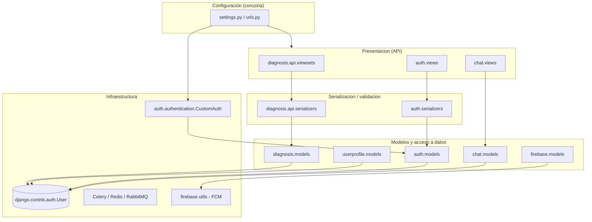
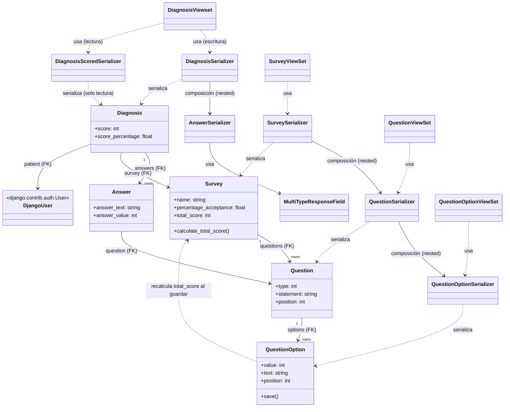

# Backend 1 — Análisis de arquitectura

## 1. Capas de la aplicación

El proyecto esta estructurado como un monolito modular utilizando el patrón de aplicaciones nativo de Django. En lugar de una division horizontal clasica, El sistema se organiza de forma verical por dominios de negocio. Cada modulo encapsula su propia lógica.

### Capas identificadas

- Manejo de solicitudes y API:
Esta parte de la aplicación se encarga de recibir las solicitudes que realizan los clientes y dirigirlas hacia la funcionalidad correspondiente.
En el proyecto esta responsabilidad se encuentra principalmente en los `ViewSets` y las `URL` de Django.

- Serialización y validación:
Esta parte se encarga de transformar los datos enviados y recibidos por la API, además de realizar validaciones.
En el proyecto esta responsabilidad se encuentra principalmente en los archivos `serializers.py`.

- Modelos y acceso a datos:
Esta parte del software representa las diferentes entidades y permite interactuar con la base de datos mediante el ORM de django. Esta responsabilidad se encuentra principalmente en los archivos `models.py`.

- Capa de configuración e infraestructura:
Esta parte contiene la configuración general del proyecto y algunos servicios utilizados por la aplicación.
Se encuentra principalmente en el paquete `corozina` y en el paquete `firebase`.

## 2. Responsabilidad de cada paquete

- **auth:** Responsable de las funcionalidades relacionadas con autenticación y manejo de usuarios.
- **chat:** Responsable de las funcionalidades relacionadas con el chat de la aplicación.
- **corozina:** Contiene la configuración principal del proyecto Django, incluyendo URLs, configuración, ASGI, WSGI y Celery.
- **diagnosis:** Contiene principalmente las funcionalidades de los cuestionarios y diagnosticos
Incluye modelos, serializers, ViewSets, URLs y utilidades relacionadas con los diagnósticos.
- **firebase:** Contiene funcionalidades relacionadas con la integración con Firebase Cloud para el envio de notificaciones a los usuarios.
- **requirements:** No es código de la aplicación: contiene los archivos de dependencias por entorno
- **userprofile:** Responsable en las funcionalidades relacionadas con el perfil de los usuarios.

## 3. Responsabilidad de cada clase del paquete diagnosis
`diagnosis/models.py`
- **Survey:** Representa una encuesta de sintomas. Guarda name, percentage_acceptance y el total_score, Tiene un metodo calculate_total_score que recorre todas las preguntas y suma el valor máximo de sus opciones.
- **Question:** Modela una pregunta de la encuesta. Define el enunciado, su orden secuencial y su tipo de respuesta (valores permitidos en constants.py: sí/no, opción única y opción múltiple).
- **QuestionOption:** Una opcion de respuesta posible para una encuesta con un valor numerico usado para el puntaje
- **Diagnosis:** El resultado de un paciente al responder una encuesta.
- **Answer:** la respuesta puntual de un paciente a una pregunta dentro de un diagnóstico.

`diagnosis/api/serializers.py`
- **QuestionOptionSerializer, QuestionSerializer, SurveySerializer:** Convierten los modelos a JSON y viceversa para la API. Como una encuesta tiene preguntas y las preguntas tienen opciones, estos serializers se anidan entre sí para poder representar toda esa estructura junta en un solo JSON.
- **AnswerSerializer, DiagnosisSerializer, DiagnosisScoredSerializer:** son los que se encargan de recibir las respuestas que da el paciente, revisar que tengan sentido que la respuesta sí esté entre las opciones válidas de esa pregunta y con eso armar el diagnóstico completo. Una vez el diagnóstico ya existe, DiagnosisScoredSerializer es el que se usa para mostrarle al paciente el resultado.
- **MultiTypeResponseField:** campo custom que acepta texto o booleano como respuesta.
- **SurveyViewSet, QuestionViewSet, QuestionOptionViewSet, DiagnosisViewset:** son las clases que exponen cada modelo como una API REST — es decir, gracias a ellas existen las rutas para crear, ver, editar y borrar encuestas, preguntas, opciones y diagnósticos desde afuera por ejemplo, desde el frontend o Postman, sin tener que escribir cada endpoint a mano.

## 4. Diagrama de clases de diagnosis

## 5. Riesgos de la arquitectura actual y mejoras propuestas
**Riesgo 1 — Exposición de SECRET_KEY y DEBUG = True en el código**

En la clase `setting_local_example.py` se visualiza que la clave criptográfica se encuentra expuesta directamente en el codigo y la DEBUT se encuentra con el valor true activa eso provoca que si el codigo se encuentra en GitHub cualquier atacante puede clonar las sesiones, falsificar tokens JWT y ver rutas del servidor o variables de entorno.

**Mejora:** Implementar variables de entorno utilizando la librería python-dotenv. De esta manera, el código de Django queda limpio de credenciales y los valores reales se inyectan únicamente en el servidor en producción a través de un archivo .env que se excluye del control de versiones en el .gitignore

**Riesgo 2 — Mantenibilidad: lógica de negocio dispersa**

El cálculo del puntaje de la encuesta está regado en tres lugares diferentes: el modelo Survey, el método save() de QuestionOption y en utils.py.

**Mejora:** Crear una capa de servicios y meter la logica de negocio en ese modulo, saco el cálculo de los modelos y de utils.py, y lo meteremos todo en una sola clase o archivo dedicado, por ejemplo: diagnosis/services.py 

**Riesgo 3 — Escalabilidad: acoplamiento cruzado con userprofile**

En el modelo Diagnosis, el campo patient (paciente) está conectado directamente con el usuario básico de Django (`User`), pero no con el modelo Profile, que es el que realmente indica si ese usuario es un doctor o un paciente. Como no hay ninguna validación que lo impida, en teoría se podría registrar un diagnóstico donde el paciente en realidad sea un usuario marcado como doctor, y el sistema no se daría cuenta de que eso está mal, porque nada se lo está preguntando.

**Mejora:** hacer que el campo patient apunte al modelo Profile en lugar de al User directamente, y agregar una validación que revise que la persona que se está registrando como paciente realmente tenga el tipo paciente antes de guardar el diagnóstico.

## 6. Migración a Python 3.12 y Django 5.x

**Ruptura de dependencias desactualizadas:** El proyecto usa librerías de hace varios años Django==3.0.4, djangorestframework==3.11.0, djangorestframework-simplejwt==4.4.0, django-rest-framework-social-oauth2==1.1.0, django_celery_beat==2.0.0 y Pillow==7.0.0. Todas son de 2019-2020, y el problema no es solo que sean viejas, sino que actualizar Python o Django de un salto tan grande casi nunca es compatible con versiones tan antiguas de estas librerías.

De hecho, al intentar correr el proyecto en mi computador con Python 3.13.2, me di cuenta de que ni siquiera arranca: celery==4.4.2 usa una función de Python formatargspec que ya fue eliminada en versiones recientes. Esto confirma que el problema no es solo teórico, sino que ya está pasando ahora mismo con Python 3.12.

Antes de migrar a Python 3.12 y Django 5.x, tocaría revisar una por una estas librerías para ver si tienen una versión más nueva compatible, o si hay que reemplazarlas por otra alternativa.

**Cambios de Django 3 a 5:** Django 5 elimina o cambia varias configuraciones que el proyecto actual todavía usa o podría llegar a necesitar:
- `USE_L10N`: el proyecto la tiene en `True` dentro de `settings.py`. En Django 5 esta opción ya no existe, porque ahora ese comportamiento (mostrar fechas y números según el idioma) siempre está activado. Entonces esa línea del `settings.py` simplemente hay que borrarla.
- `AUTHENTICATION_BACKENDS`: el proyecto tiene su propio sistema de login CustomAuth, en auth/authentication.py. Django 5 cambia un poco cómo maneja las contraseñas por dentro, así que habría que probar que ese login personalizado siga funcionando bien después de actualizar.

**Cambios de Python 3.7 a 3.12:**
- distutils fue eliminado en Python 3.12. Es una librería vieja que Python traía incluida, y algunas dependencias del proyecto estan usándola.
- habría que revisar compatibilidad de celery==4.4.2 con Python 3.12 versiones tan antiguas de Celery no soportan Python moderno.

**Base de datos:** el proyecto usa SQLite en desarrollo vía settings.py; conviene confirmar el motor real de producción psycopg2_binary está en requirements, sugiriendo PostgreSQL y validar compatibilidad de versión con Django 5.x.

Qué haría primero:
- Congelar el comportamiento actual con una suite de tests de regresión el proyecto trae carpetas tests/ en diagnosis y chat, pero conviene ampliar cobertura antes de tocar nada, para poder detectar rupturas silenciosas durante la migración.
- Actualizar dependencias de forma incremental y aislada en lugar de saltar directo de Django 3.0 a 5.x.
- Resolver primero el problema de SECRET_KEY yconfiguración ya que cualquier cambio de infraestructura es más seguro de hacer sobre una base de configuración correcta.# Backend 1 — Análisis de arquitectura

## 1. Capas de la aplicación

El proyecto esta estructurado como un monolito modular utilizando el patrón de aplicaciones nativo de Django. En lugar de una division horizontal clasica, El sistema se organiza de forma verical por dominios de negocio. Cada modulo encapsula su propia lógica.

### Capas identificadas

- Manejo de solicitudes y API:
Esta parte de la aplicación se encarga de recibir las solicitudes que realizan los clientes y dirigirlas hacia la funcionalidad correspondiente.
En el proyecto esta responsabilidad se encuentra principalmente en los `ViewSets` y las `URL` de Django.

- Serialización y validación:
Esta parte se encarga de transformar los datos enviados y recibidos por la API, además de realizar validaciones.
En el proyecto esta responsabilidad se encuentra principalmente en los archivos `serializers.py`.

- Modelos y acceso a datos:
Esta parte del software representa las diferentes entidades y permite interactuar con la base de datos mediante el ORM de django. Esta responsabilidad se encuentra principalmente en los archivos `models.py`.

- Capa de configuración e infraestructura:
Esta parte contiene la configuración general del proyecto y algunos servicios utilizados por la aplicación.
Se encuentra principalmente en el paquete `corozina` y en el paquete `firebase`.

## 2. Responsabilidad de cada paquete

- **auth:** Responsable de las funcionalidades relacionadas con autenticación y manejo de usuarios.
- **chat:** Responsable de las funcionalidades relacionadas con el chat de la aplicación.
- **corozina:** Contiene la configuración principal del proyecto Django, incluyendo URLs, configuración, ASGI, WSGI y Celery.
- **diagnosis:** Contiene principalmente las funcionalidades de los cuestionarios y diagnosticos
Incluye modelos, serializers, ViewSets, URLs y utilidades relacionadas con los diagnósticos.
- **firebase:** Contiene funcionalidades relacionadas con la integración con Firebase Cloud para el envio de notificaciones a los usuarios.
- **requirements:** No es código de la aplicación: contiene los archivos de dependencias por entorno
- **userprofile:** Responsable en las funcionalidades relacionadas con el perfil de los usuarios.

## 3. Responsabilidad de cada clase del paquete diagnosis
`diagnosis/models.py`
- **Survey:** Representa una encuesta de sintomas. Guarda name, percentage_acceptance y el total_score, Tiene un metodo calculate_total_score que recorre todas las preguntas y suma el valor máximo de sus opciones.
- **Question:** Modela una pregunta de la encuesta. Define el enunciado, su orden secuencial y su tipo de respuesta (valores permitidos en constants.py: sí/no, opción única y opción múltiple).
- **QuestionOption:** Una opcion de respuesta posible para una encuesta con un valor numerico usado para el puntaje
- **Diagnosis:** El resultado de un paciente al responder una encuesta.
- **Answer:** la respuesta puntual de un paciente a una pregunta dentro de un diagnóstico.

`diagnosis/api/serializers.py`
- **QuestionOptionSerializer, QuestionSerializer, SurveySerializer:** Convierten los modelos a JSON y viceversa para la API. Como una encuesta tiene preguntas y las preguntas tienen opciones, estos serializers se anidan entre sí para poder representar toda esa estructura junta en un solo JSON.
- **AnswerSerializer, DiagnosisSerializer, DiagnosisScoredSerializer:** son los que se encargan de recibir las respuestas que da el paciente, revisar que tengan sentido que la respuesta sí esté entre las opciones válidas de esa pregunta y con eso armar el diagnóstico completo. Una vez el diagnóstico ya existe, DiagnosisScoredSerializer es el que se usa para mostrarle al paciente el resultado.
- **MultiTypeResponseField:** campo custom que acepta texto o booleano como respuesta.
- **SurveyViewSet, QuestionViewSet, QuestionOptionViewSet, DiagnosisViewset:** son las clases que exponen cada modelo como una API REST — es decir, gracias a ellas existen las rutas para crear, ver, editar y borrar encuestas, preguntas, opciones y diagnósticos desde afuera por ejemplo, desde el frontend o Postman, sin tener que escribir cada endpoint a mano.

## 4. Diagrama de clases de diagnosis

## 5. Riesgos de la arquitectura actual y mejoras propuestas
**Riesgo 1 — Exposición de SECRET_KEY y DEBUG = True en el código**

En la clase `setting_local_example.py` se visualiza que la clave criptográfica se encuentra expuesta directamente en el codigo y la DEBUT se encuentra con el valor true activa eso provoca que si el codigo se encuentra en GitHub cualquier atacante puede clonar las sesiones, falsificar tokens JWT y ver rutas del servidor o variables de entorno.

**Mejora:** Implementar variables de entorno utilizando la librería python-dotenv. De esta manera, el código de Django queda limpio de credenciales y los valores reales se inyectan únicamente en el servidor en producción a través de un archivo .env que se excluye del control de versiones en el .gitignore

**Riesgo 2 — Mantenibilidad: lógica de negocio dispersa**

El cálculo del puntaje de la encuesta está regado en tres lugares diferentes: el modelo Survey, el método save() de QuestionOption y en utils.py.

**Mejora:** Crear una capa de servicios y meter la logica de negocio en ese modulo, saco el cálculo de los modelos y de utils.py, y lo meteremos todo en una sola clase o archivo dedicado, por ejemplo: diagnosis/services.py 

**Riesgo 3 — Escalabilidad: acoplamiento cruzado con userprofile**

En el modelo Diagnosis, el campo patient (paciente) está conectado directamente con el usuario básico de Django (`User`), pero no con el modelo Profile, que es el que realmente indica si ese usuario es un doctor o un paciente. Como no hay ninguna validación que lo impida, en teoría se podría registrar un diagnóstico donde el paciente en realidad sea un usuario marcado como doctor, y el sistema no se daría cuenta de que eso está mal, porque nada se lo está preguntando.

**Mejora:** hacer que el campo patient apunte al modelo Profile en lugar de al User directamente, y agregar una validación que revise que la persona que se está registrando como paciente realmente tenga el tipo paciente antes de guardar el diagnóstico.

## 6. Migración a Python 3.12 y Django 5.x

**Ruptura de dependencias desactualizadas:** El proyecto usa librerías de hace varios años Django==3.0.4, djangorestframework==3.11.0, djangorestframework-simplejwt==4.4.0, django-rest-framework-social-oauth2==1.1.0, django_celery_beat==2.0.0 y Pillow==7.0.0. Todas son de 2019-2020, y el problema no es solo que sean viejas, sino que actualizar Python o Django de un salto tan grande casi nunca es compatible con versiones tan antiguas de estas librerías.

De hecho, al intentar correr el proyecto en mi computador con Python 3.13.2, me di cuenta de que ni siquiera arranca: celery==4.4.2 usa una función de Python formatargspec que ya fue eliminada en versiones recientes. Esto confirma que el problema no es solo teórico, sino que ya está pasando ahora mismo con Python 3.12.

Antes de migrar a Python 3.12 y Django 5.x, tocaría revisar una por una estas librerías para ver si tienen una versión más nueva compatible, o si hay que reemplazarlas por otra alternativa.

**Cambios de Django 3 a 5:** Django 5 elimina o cambia varias configuraciones que el proyecto actual todavía usa o podría llegar a necesitar:
- `USE_L10N`: el proyecto la tiene en `True` dentro de `settings.py`. En Django 5 esta opción ya no existe, porque ahora ese comportamiento (mostrar fechas y números según el idioma) siempre está activado. Entonces esa línea del `settings.py` simplemente hay que borrarla.
- `AUTHENTICATION_BACKENDS`: el proyecto tiene su propio sistema de login CustomAuth, en auth/authentication.py. Django 5 cambia un poco cómo maneja las contraseñas por dentro, así que habría que probar que ese login personalizado siga funcionando bien después de actualizar.

**Cambios de Python 3.7 a 3.12:**
- distutils fue eliminado en Python 3.12. Es una librería vieja que Python traía incluida, y algunas dependencias del proyecto estan usándola.
- habría que revisar compatibilidad de celery==4.4.2 con Python 3.12 versiones tan antiguas de Celery no soportan Python moderno.

**Base de datos:** el proyecto usa SQLite en desarrollo vía settings.py; conviene confirmar el motor real de producción psycopg2_binary está en requirements, sugiriendo PostgreSQL y validar compatibilidad de versión con Django 5.x.

Qué haría primero:
- Congelar el comportamiento actual con una suite de tests de regresión el proyecto trae carpetas tests/ en diagnosis y chat, pero conviene ampliar cobertura antes de tocar nada, para poder detectar rupturas silenciosas durante la migración.
- Actualizar dependencias de forma incremental y aislada en lugar de saltar directo de Django 3.0 a 5.x.
- Resolver primero el problema de SECRET_KEY yconfiguración ya que cualquier cambio de infraestructura es más seguro de hacer sobre una base de configuración correcta.